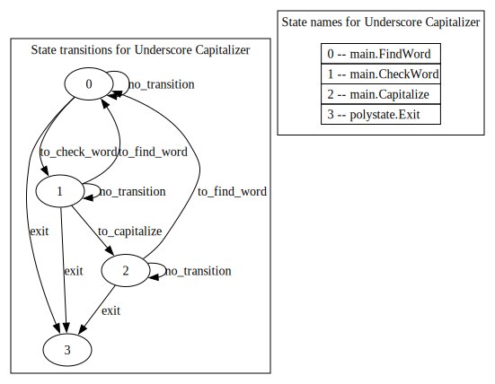
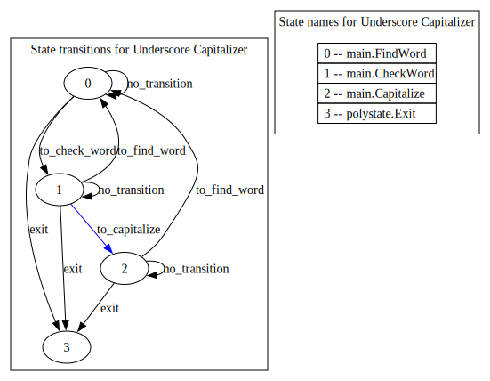
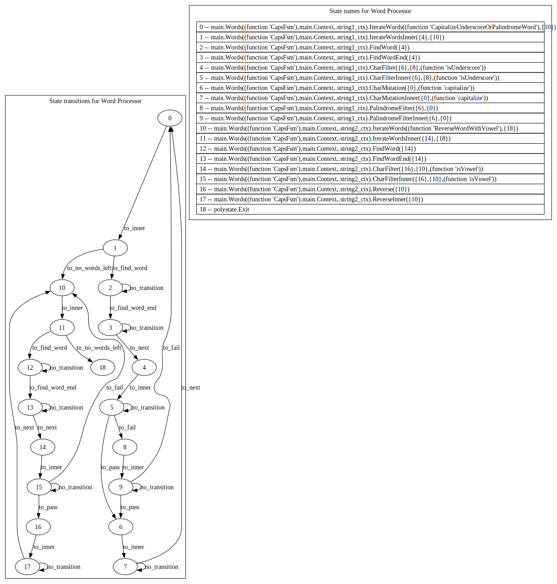

# Polystate

**Build type-safe finite state machines with higher-order states.**

With Polystate, you can write 'state functions' that produce entirely new states, whose transitions are decided by a set of parameters. This enables composition: constructing states using other states, or even other state functions.

## Adding Polystate to your project

Download and add Polystate as a dependency by running the following command in your project root:
```shell
zig fetch --save git+https://github.com/sdzx-1/polystate.git
```

Then, retrieve the dependency in your build.zig:
```zig
const polystate = b.dependency("polystate", .{
    .target = target,
    .optimize = optimize,
});
```

Finally, add the dependency's module to your module's imports:
```zig
exe_mod.addImport("polystate", polystate.module("root"));
```

You should now be able to import Polystate in your module's code:
```zig
const ps = @import("polystate");
```

## The basics

Let's build a state machine that completes a simple task: capitalize all words in a string that contain an underscore.

Our state machine will contain three states: `FindWord`, `CheckWord`, and `Capitalize`:
- `FindWord` finds the start of a word. `FindWord` transitions to `CheckWord` if it finds the start of a word.
- `CheckWord` checks if an underscore exists in the word. `CheckWord` transitions to `Capitalize` if an underscore is found, or transitions back to `FindWord` if no underscore is found.
- `Capitalize` capitalizes the word. `Capitalize` transitions back to `FindWord` once the word is capitalized.

Here's our state machine implemented with Polystate:
<details open>
<summary><code>main.zig</code></summary>

```zig
const std = @import("std");
const ps = @import("polystate");

pub const FindWord = union(enum) {
    to_check_word: CapsFsm(CheckWord),
    exit: CapsFsm(ps.Exit),
    no_transition: CapsFsm(FindWord),

    pub fn handler(ctx: *Context) FindWord {
        switch (ctx.string[0]) {
            0 => return .exit,
            ' ', '\t'...'\r' => {
                ctx.string += 1;
                return .no_transition;
            },
            else => {
                ctx.word = ctx.string;
                return .to_check_word;
            },
        }
    }
};

pub const CheckWord = union(enum) {
    to_find_word: CapsFsm(FindWord),
    to_capitalize: CapsFsm(Capitalize),
    exit: CapsFsm(ps.Exit),
    no_transition: CapsFsm(CheckWord),

    pub fn handler(ctx: *Context) CheckWord {
        switch (ctx.string[0]) {
            0 => return .exit,
            ' ', '\t'...'\r' => {
                ctx.string += 1;
                return .to_find_word;
            },
            '_' => {
                ctx.string = ctx.word;
                return .to_capitalize;
            },
            else => {
                ctx.string += 1;
                return .no_transition;
            },
        }
    }
};

pub const Capitalize = union(enum) {
    to_find_word: CapsFsm(FindWord),
    exit: CapsFsm(ps.Exit),
    no_transition: CapsFsm(Capitalize),

    pub fn handler(ctx: *Context) Capitalize {
        switch (ctx.string[0]) {
            0 => return .exit,
            ' ', '\t'...'\r' => {
                ctx.string += 1;
                return .to_find_word;
            },
            else => {
                ctx.string[0] = std.ascii.toUpper(ctx.string[0]);
                ctx.string += 1;
                return .no_transition;
            },
        }
    }
};

pub const Context = struct {
    string: [*:0]u8,
    word: [*:0]u8,

    pub fn init(string: [:0]u8) Context {
        return .{
            .string = string.ptr,
            .word = string.ptr,
        };
    }
};

pub fn CapsFsm(comptime State: type) type {
    return ps.FSM("Underscore Capitalizer", .not_suspendable, Context, null, {}, State);
}

pub fn main() void {
    const StartingFsmState = CapsFsm(FindWord);

    const Runner = ps.Runner(true, StartingFsmState);

    var string_backing =
        \\capitalize_me 
        \\DontCapitalizeMe 
        \\ineedcaps_  _IAlsoNeedCaps idontneedcaps
        \\_/\o_o/\_ <-- wide_eyed
    .*;
    const string: [:0]u8 = &string_backing;

    var ctx: Context = .init(string);

    const starting_state_id = Runner.idFromState(StartingFsmState.State);

    std.debug.print("Without caps:\n{s}\n\n", .{string});

    Runner.runHandler(starting_state_id, &ctx);

    std.debug.print("With caps:\n{s}\n", .{string});
}
```

</details>

---

<details open>
<summary>Transition graph for <code>main.zig</code></summary>



</details>

---

As you can see, each of our states is represented by a tagged union. These unions have two main components: their fields and their `handler` function.

Rules for the fields:
- Each field represents one of the state's transitions.
- The type of a field describes the transition, primarily what the transitioned-to state will be.
- Field types must be generated by `ps.FSM`, which wraps state union types and attaches additional information about the transition and its state machine.
- For a single state machine's transitions, `ps.FSM` must always be given the same name, mode, and context type. In our case, we ensure this by wrapping `ps.FSM` with `CapsFsm`. In `CapsFsm`, the name is set to `"Underscore Capitalizer"`, the mode is set to `not_suspendable`, and the context type is set to `Context`.

Rules for the `handler` function:
- `handler` executes the state's logic and determines which transition to take.
- `handler` takes a context parameter (`ctx`), which points to mutable data that is shared across all states.
- `handler` returns a transition (one of the state's union fields).

Once we have defined the states of our state machine, we make a runner using `ps.Runner`. Just like our state's transition types, the starting state we pass into `ps.Runner` must be generated using `ps.FSM`, which we accomplish using our `CapsFsm` wrapper: `CapsFsm(FindWord)`. Since our FSM's mode is set to `not_suspendable`, calling `runHandler` on our runner will run the state machine until completion (when the special `ps.Exit` state is reached). 

`runHandler` also requires the 'state ID' of the state you want to start at. A runner provides both the `StateId` type and functions to convert between states and their ID. We use this to get the starting state ID: `Runner.idFromState(StartingFsmState.State)`.

It may seem odd that we call `idFromState` with `StartingFsmState.State` instead of `StartingFsmState`, but this is because `StartingFsmState` is the wrapper type produced by `ps.FSM`, whereas `StartingFsmState.State` is the underlying state (`FindWord`). That's why we call it `StartingFsmState` instead of `StartingState`: the 'FSM' naming convention helps us remember that it's a wrapped state, and that we need to use its `State` declaration if we want the state it is wrapping.

## Suspendable state machines
In our previous example, our state machine's mode was `not_suspendable`. What if we set it to `suspendable`? Well, this would allow us to 'suspend' the execution of our state machine, run code outside of the state machine, and then resume the execution of our state machine.

However, `suspendable` adds an additional requirement to your state transitions: they must tell the state machine whether or not to suspend after transitioning.

This is our capitalization state machine, updated such that every time a word is chosen to be capitalized, we suspend execution and print the chosen word:


<details>
<summary><code>main.zig</code></summary>

```zig
const std = @import("std");
const ps = @import("polystate");

pub const FindWord = union(enum) {
    to_check_word: CapsFsm(.current, CheckWord),
    exit: CapsFsm(.current, ps.Exit),
    no_transition: CapsFsm(.current, FindWord),

    pub fn handler(ctx: *Context) FindWord {
        switch (ctx.string[0]) {
            0 => return .exit,
            ' ', '\t'...'\r' => {
                ctx.string += 1;
                return .no_transition;
            },
            else => {
                ctx.word = ctx.string;
                return .to_check_word;
            },
        }
    }
};

pub const CheckWord = union(enum) {
    to_find_word: CapsFsm(.current, FindWord),
    to_capitalize: CapsFsm(.next, Capitalize),
    exit: CapsFsm(.current, ps.Exit),
    no_transition: CapsFsm(.current, CheckWord),

    pub fn handler(ctx: *Context) CheckWord {
        switch (ctx.string[0]) {
            0 => return .exit,
            ' ', '\t'...'\r' => {
                ctx.string += 1;
                return .to_find_word;
            },
            '_' => {
                ctx.string = ctx.word;
                return .to_capitalize;
            },
            else => {
                ctx.string += 1;
                return .no_transition;
            },
        }
    }
};

pub const Capitalize = union(enum) {
    to_find_word: CapsFsm(.current, FindWord),
    exit: CapsFsm(.current, ps.Exit),
    no_transition: CapsFsm(.current, Capitalize),

    pub fn handler(ctx: *Context) Capitalize {
        switch (ctx.string[0]) {
            0 => return .exit,
            ' ', '\t'...'\r' => {
                ctx.string += 1;
                return .to_find_word;
            },
            else => {
                ctx.string[0] = std.ascii.toUpper(ctx.string[0]);
                ctx.string += 1;
                return .no_transition;
            },
        }
    }
};

pub const Context = struct {
    string: [*:0]u8,
    word: [*:0]u8,

    pub fn init(string: [:0]u8) Context {
        return .{
            .string = string.ptr,
            .word = string.ptr,
        };
    }
};

pub fn CapsFsm(comptime method: ps.Method, comptime State: type) type {
    return ps.FSM("Underscore Capitalizer", .suspendable, Context, null, method, State);
}

pub fn main() void {
    const StartingFsmState = CapsFsm(.current, FindWord);

    const Runner = ps.Runner(true, StartingFsmState);

    var string_backing =
        \\capitalize_me 
        \\DontCapitalizeMe 
        \\ineedcaps_  _IAlsoNeedCaps idontneedcaps
        \\_/\o_o/\_ <-- wide_eyed
    .*;
    const string: [:0]u8 = &string_backing;

    var ctx: Context = .init(string);

    std.debug.print("Without caps:\n{s}\n\n", .{string});

    var state_id = Runner.idFromState(StartingFsmState.State);

    while (Runner.runHandler(state_id, &ctx)) |new_state_id| {
        state_id = new_state_id;

        var word_len: usize = 0;
        while (ctx.word[word_len] != 0 and !std.ascii.isWhitespace(ctx.word[word_len])) {
            word_len += 1;
        }

        const word = ctx.word[0..word_len];

        std.debug.print("capitalizing word: {s}\n", .{word});
    }

    std.debug.print("\nWith caps:\n{s}\n", .{string});
}
```

</details>

---

<details>
<summary>Transition graph for <code>main.zig</code></summary>



</details>

---

We've updated our `CapsFsm` wrapper to take an additional parameter of type `ps.Method`, which has two possible values: `current` and `next`.

- If a transition has the method `current`, the state machine will continue execution after transitioning.
- If a transition has the method `next`, the state machine will suspend execution after transitioning.

A transition's `ps.Method` basically answers the following question: "Should I set this new state as my current state and keep going (`current`), or save this new state for the next execution (`next`)?".

In addition to updating our state transitions with `current` or `next`, we also need to change how we use `runHandler`.

Before, since our state machine was `not_suspendable`, `runHandler` didn't return anything and only needed to be called once. Now, since our state machine is `suspendable`, `runHandler` only runs the state machine until it is suspended, and returns the ID of the state it was suspended on.

So, we now call `runHandler` in a loop, passing in the current state ID and using the result as the new state ID. We continue this until `runHandler` returns `null`, indicating that the state machine has completed (reached ps.Exit).

## Higher-order states and composability
If you've read the previous sections where we cover the basics of Polystate, you may feel like it's a bit overkill to use a library instead of just implementing your FSM manually. After all, it can seem like Polystate does little more than provide a convenient framework for structuring state machines.

This changes when you start using higher-order states.

A higher-order state is a function that takes states as parameters and returns a new state, AKA a 'state function'. Since states are represented as types (specifically, tagged unions), a state function is no different than any other Zig generic: a type-returning function that takes types as parameters.

---

While being simple at their core, higher-order states allow endless ways to construct, compose, and re-use transition logic among your states. We will demonstrate this by expanding on our previous state machine, making it perform various new word-processing operations.

Our capitalization state machine was designed with one purpose: capitalize words with underscores. Sure you could tweak it, splicing in new states to add additional processing steps... only for it to decline into a spaghetti-like mess, becoming less decipherable with each new state. If we want to make our state machine truly extendable, we'll need to try another approach.

Let's make a new utility called `Words` that will provide us with several state functions, producing states that operate on a `WordsContext`. These state functions will allow us to construct word operations, expressing in a consistent manner both the word mutations and the conditions in which those mutations occur. 

As a bonus, `Words` itself will be produced by a generic function, automatically specializing its state functions based on its parameters. This allows `Words` to be used in any state machine, and even lets you create multiple independent instances of `Words` in one state machine, each one having its own `WordsContext`!

Our new state machine will demonstrate the capabilities of `Words`, using two independent instances of `Words` to do the following:
1. Capitalize all words in string 1 that contain an underscore or are palindromes.
2. Reverse all words in string 2 that contain a vowel.

Here's the implementation:

<details>
<summary><code>main.zig</code></summary>

```zig
const std = @import("std");
const ps = @import("polystate");

pub fn Words(
    comptime Fsm: fn (State: type) type,
    comptime ParentContext: type,
    comptime ctx_field: std.meta.FieldEnum(ParentContext),
) type {
    return struct {
        pub fn IterateWords(
            comptime WordOperation: fn (Next: type) type,
            comptime NoWordsLeft: type,
        ) type {
            return union(enum) {
                to_inner: Fsm(IterateWordsInner(WordOperation(@This()), NoWordsLeft)),

                pub fn handler(parent_ctx: *ParentContext) @This() {
                    const ctx = ctxFromParent(parent_ctx);
                    ctx.head = ctx.word_end;
                    return .to_inner;
                }
            };
        }

        pub fn IterateWordsInner(
            comptime FoundWord: type,
            comptime NoWordsLeft: type,
        ) type {
            return union(enum) {
                to_find_word: Fsm(FindWord(FoundWord)),
                to_no_words_left: Fsm(NoWordsLeft),

                pub fn handler(parent_ctx: *ParentContext) @This() {
                    const ctx = ctxFromParent(parent_ctx);
                    if (ctx.word_end >= ctx.string.len) {
                        return .to_no_words_left;
                    } else {
                        return .to_find_word;
                    }
                }
            };
        }

        pub fn FindWord(comptime Next: type) type {
            return union(enum) {
                to_find_word_end: Fsm(FindWordEnd(Next)),
                no_transition: Fsm(@This()),

                pub fn handler(parent_ctx: *ParentContext) @This() {
                    const ctx = ctxFromParent(parent_ctx);
                    if (ctx.head >= ctx.string.len) {
                        ctx.word_start = ctx.head;
                        ctx.word_end = ctx.head;
                        return .to_find_word_end;
                    }
                    switch (ctx.string[ctx.head]) {
                        ' ', '\t'...'\r' => {
                            ctx.head += 1;
                            return .no_transition;
                        },
                        else => {
                            ctx.word_start = ctx.head;
                            ctx.word_end = ctx.head;
                            return .to_find_word_end;
                        },
                    }
                }
            };
        }

        pub fn FindWordEnd(comptime Next: type) type {
            return union(enum) {
                to_next: Fsm(Next),
                no_transition: Fsm(@This()),

                pub fn handler(parent_ctx: *ParentContext) @This() {
                    const ctx = ctxFromParent(parent_ctx);
                    if (ctx.word_end >= ctx.string.len) {
                        return .to_next;
                    }
                    switch (ctx.string[ctx.word_end]) {
                        ' ', '\t'...'\r' => return .to_next,
                        else => {
                            ctx.word_end += 1;
                            return .no_transition;
                        },
                    }
                }
            };
        }

        pub fn CharMutation(
            comptime Next: type,
            mutateChar: fn (char: u8) u8,
        ) type {
            return union(enum) {
                to_inner: Fsm(CharMutationInner(Next, mutateChar)),

                pub fn handler(parent_ctx: *ParentContext) @This() {
                    const ctx = ctxFromParent(parent_ctx);
                    ctx.head = ctx.word_start;
                    return .to_inner;
                }
            };
        }

        pub fn CharMutationInner(
            comptime Next: type,
            mutateChar: fn (char: u8) u8,
        ) type {
            return union(enum) {
                to_next: Fsm(Next),
                no_transition: Fsm(@This()),

                pub fn handler(parent_ctx: *ParentContext) @This() {
                    const ctx = ctxFromParent(parent_ctx);
                    if (ctx.head >= ctx.word_end) {
                        return .to_next;
                    } else {
                        ctx.string[ctx.head] = mutateChar(ctx.string[ctx.head]);
                        ctx.head += 1;
                        return .no_transition;
                    }
                }
            };
        }

        pub fn Reverse(comptime Next: type) type {
            return union(enum) {
                to_inner: Fsm(ReverseInner(Next)),

                pub fn handler(parent_ctx: *ParentContext) @This() {
                    const ctx = ctxFromParent(parent_ctx);
                    ctx.tail = ctx.word_start;
                    ctx.head = ctx.word_end - 1;
                    return .to_inner;
                }
            };
        }

        pub fn ReverseInner(comptime Next: type) type {
            return union(enum) {
                to_next: Fsm(Next),
                no_transition: Fsm(@This()),

                pub fn handler(parent_ctx: *ParentContext) @This() {
                    const ctx = ctxFromParent(parent_ctx);
                    if (ctx.tail >= ctx.head) {
                        return .to_next;
                    } else {
                        const temp = ctx.string[ctx.tail];
                        ctx.string[ctx.tail] = ctx.string[ctx.head];
                        ctx.string[ctx.head] = temp;
                        ctx.tail += 1;
                        ctx.head -= 1;
                        return .no_transition;
                    }
                }
            };
        }

        pub fn CharFilter(
            comptime Pass: type,
            comptime Fail: type,
            comptime predicate: fn (char: u8) bool,
        ) type {
            return union(enum) {
                to_inner: Fsm(CharFilterInner(Pass, Fail, predicate)),

                pub fn handler(parent_ctx: *ParentContext) @This() {
                    const ctx = ctxFromParent(parent_ctx);
                    ctx.head = ctx.word_start;
                    return .to_inner;
                }
            };
        }

        pub fn CharFilterInner(
            comptime Pass: type,
            comptime Fail: type,
            comptime predicate: fn (char: u8) bool,
        ) type {
            return union(enum) {
                to_pass: Fsm(Pass),
                to_fail: Fsm(Fail),
                no_transition: Fsm(@This()),

                pub fn handler(parent_ctx: *ParentContext) @This() {
                    const ctx = ctxFromParent(parent_ctx);
                    if (ctx.head >= ctx.word_end) {
                        return .to_fail;
                    }
                    if (predicate(ctx.string[ctx.head])) {
                        return .to_pass;
                    } else {
                        ctx.head += 1;
                        return .no_transition;
                    }
                }
            };
        }

        pub fn PalindromeFilter(
            comptime Pass: type,
            comptime Fail: type,
        ) type {
            return union(enum) {
                to_inner: Fsm(PalindromeFilterInner(Pass, Fail)),

                pub fn handler(parent_ctx: *ParentContext) @This() {
                    const ctx = ctxFromParent(parent_ctx);
                    ctx.tail = ctx.word_start;
                    ctx.head = ctx.word_end - 1;
                    return .to_inner;
                }
            };
        }

        pub fn PalindromeFilterInner(
            comptime Pass: type,
            comptime Fail: type,
        ) type {
            return union(enum) {
                to_pass: Fsm(Pass),
                to_fail: Fsm(Fail),
                no_transition: Fsm(@This()),

                pub fn handler(parent_ctx: *ParentContext) @This() {
                    const ctx = ctxFromParent(parent_ctx);
                    if (ctx.tail >= ctx.head) {
                        return .to_pass;
                    } else if (ctx.string[ctx.tail] != ctx.string[ctx.head]) {
                        return .to_fail;
                    } else {
                        ctx.tail += 1;
                        ctx.head -= 1;
                        return .no_transition;
                    }
                }
            };
        }

        fn ctxFromParent(parent_ctx: *ParentContext) *WordsContext {
            return &@field(parent_ctx, @tagName(ctx_field));
        }
    };
}

pub const WordsContext = struct {
    string: []u8,
    head: usize,
    word_start: usize,
    word_end: usize,
    tail: usize,

    pub fn init(string: []u8) WordsContext {
        return .{
            .string = string,
            .head = 0,
            .word_start = 0,
            .word_end = 0,
            .tail = 0,
        };
    }
};

pub const Context = struct {
    string1_ctx: WordsContext,
    string2_ctx: WordsContext,

    pub fn init(string1: []u8, string2: []u8) Context {
        return .{
            .string1_ctx = .init(string1),
            .string2_ctx = .init(string2),
        };
    }
};

pub fn CapsFsm(comptime State: type) type {
    return ps.FSM("Word Processor", .not_suspendable, Context, null, {}, State);
}

const string1_states = struct {
    const W = Words(CapsFsm, Context, .string1_ctx);

    fn isUnderscore(char: u8) bool {
        return char == '_';
    }

    fn capitalize(char: u8) u8 {
        return std.ascii.toUpper(char);
    }

    pub fn UnderscoreFilter(comptime Pass: type, comptime Fail: type) type {
        return W.CharFilter(Pass, Fail, isUnderscore);
    }

    pub fn Capitalize(comptime Next: type) type {
        return W.CharMutation(Next, capitalize);
    }

    pub fn UnderscoreOrPalindromeFilter(comptime Pass: type, comptime Fail: type) type {
        return UnderscoreFilter(
            Pass,
            W.PalindromeFilter(Pass, Fail),
        );
    }

    pub fn CapitalizeUnderscoreOrPalindromeWord(comptime Next: type) type {
        return UnderscoreOrPalindromeFilter(
            Capitalize(Next),
            Next,
        );
    }

    pub fn CapitalizeUnderscoreOrPalindromeWords(comptime Next: type) type {
        return W.IterateWords(
            CapitalizeUnderscoreOrPalindromeWord,
            Next,
        );
    }
};

const string2_states = struct {
    const W = Words(CapsFsm, Context, .string2_ctx);

    fn isVowel(char: u8) bool {
        return switch (char) {
            'a', 'e', 'i', 'o', 'u', 'A', 'E', 'I', 'O', 'U' => true,
            else => false,
        };
    }

    pub fn VowelFilter(comptime Pass: type, comptime Fail: type) type {
        return W.CharFilter(Pass, Fail, isVowel);
    }

    pub fn ReverseWordWithVowel(comptime Next: type) type {
        return VowelFilter(
            W.Reverse(Next),
            Next,
        );
    }

    pub fn ReverseVowelWords(comptime Next: type) type {
        return W.IterateWords(
            ReverseWordWithVowel,
            Next,
        );
    }
};

pub const EnterFsmState = CapsFsm(
    string1_states.CapitalizeUnderscoreOrPalindromeWords(
        string2_states.ReverseVowelWords(ps.Exit),
    ),
);

pub fn main() !void {
    const Runner = ps.Runner(true, EnterFsmState);

    var string1_backing =
        \\capitalize_me 
        \\DontCapitalizeMe 
        \\ineedcaps_  _IAlsoNeedCaps idontneedcaps
        \\_/\o_o/\_ <-- wide_eyed
        \\tacocat 123Hello--olleH321
    .*;

    var string2_backing =
        \\apple gym cry
        \\elephant pfft sphinx
        \\amazing fly grr
    .*;

    var ctx: Context = .init(&string1_backing, &string2_backing);

    const starting_state_id = Runner.idFromState(EnterFsmState.State);

    std.debug.print("Before processing:\n", .{});
    std.debug.print("String 1: {s}\n", .{string1_backing});
    std.debug.print("String 2: {s}\n\n", .{string2_backing});

    Runner.runHandler(starting_state_id, &ctx);

    std.debug.print("After processing:\n", .{});
    std.debug.print("String 1: {s}\n", .{string1_backing});
    std.debug.print("String 2: {s}\n", .{string2_backing});
}

```

</details>

---

<details>
<summary>Transition graph for <code>main.zig</code></summary>



</details>

---

<< TODO: finish README >>