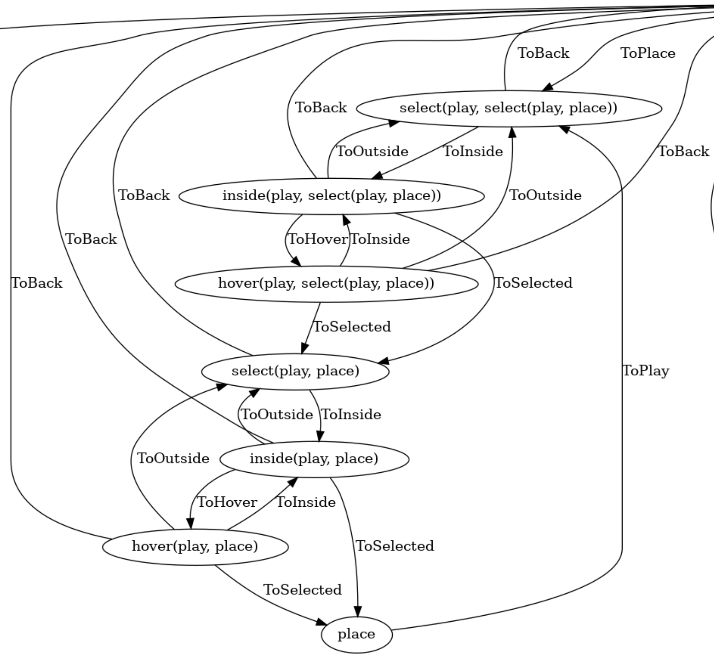

写这个文档比我想象中更困难，虽然我编写并使用了这个库有一段时间，但是想将这一切向人们讲述清楚则并不容易。

如果你看了文档有任何不明白的地方，不要犹豫立即将你的问题告诉我，我会很乐意为你解答疑惑！

你可以通过issue，或者discord，或者邮件联系我。

有限状态机是一种非常强大的编程模式，如果再加上组合性和类型安全，那么将是比较理想的编程范式。

polystate 就是为了达到这样的效果而设计的库, 它需要依赖一些编程规范才能达到这样的效果。

但是请相信我这些规范是非常简单的，并且这样做是完全值得的。

polystate的核心设计理念：
1. 在类型上记录状态机的状态
2. 通过组合类型实现组合状态机

实际达到的效果：
1. 可以通过组合式声明来确定程序的整体行为。这代表了我们有了从类型上规定程序的整体行为的能力。这极大的提升了命令式程序结构的正确性，同时这种编程方式也会促使我们从类型和组合的角度重新设计程序的状态，进而提升代码的组合性。
2. 可以通过组合简单状态构建复杂状态机。在这里我们第一次做到了：通过组合类型实现语义级的代码复用，或者说我们为语义级的代码复用找到了类型上表达方式。 这种做法同时达到了三重效果简洁，正确，安全。

这是命令式编程的伟大进步。

受益于程序整体行为由声明确定，因此polystate提供自动生成状态图的功能。

这允许用户通过状态图直观的了解程序的整体行为。

下面文章的内容就是详细解释上述的两点核心设计理念和两点实际效果。

让我们从一个具体的简单状态机例子开始，我会在代码的注释中详细介绍这个库的核心设计理念。

```zig
const std = @import("std");
const polystate = @import("polystate");

pub fn main() !void {
    var st: GST = .{};
    ///确定一个初始状态
    const wa = Example.Wit(Example.a){};
    ///用这个初始状态函消息处理函数开始执行状态机
    ///至于这里为什么使用handler_normal 这与尾递归优化有关，我会在后面详细解释。
    wa.handler_normal(&st);
}

pub const GST = struct {
    counter_a: i64 = 0,
    counter_b: i64 = 0,
};

///polystate 有两个核心的状态类型：FST（FSM Type），GST（Global State Type）。
///FST 只能是enum类型，这个例子中的FST 是Example，它定义了我们状态机的所有状态，或者说它定义了我们将要在类型上跟踪的状态集合。
///GST 是全局数据，这个例子的GST定义在上面，这里有两个字段counter_a, counter_b，分别代表a状态和b状态需要的数据。
///当我们组合状态时，我们其实想要的是组合状态处理函数。这隐含了全局数据的要求。
///因此第一个编程规范是：任意一状态的处理函数都拥有GST，即拥有全局数据，但用户应该尽量只使用状态对应的数据。
///比如这个例子中在a状态的处理函数中应该尽量只使用数据counter_a。
///通过一些命名的规范应该能很容易做到这一点，通过元编程应该很容易制作相应的通用函数，但具体的做法这不属于polystate的范围。
const Example = enum {
    ///这里定义了三个具体状态
    exit,
    a,
    b,

    ///Wit是polystate的核心概念，全称是Witness。这个词来自于[haskell](https://serokell.io/blog/haskell-type-level-witness)，它被称为 ‘type witness’ 或者 ‘runtime evidence’。
    ///有限状态机的核心概念包含四部分：状态，消息，消息处理函数，消息产生函数。我会在下面的例子中详细介绍这个几部分。
    ///Wit函数的作用是指定消息中包含的状态信息。
    pub fn Wit(val: anytype) type {
        return polystate.Witness(@This(), GST, null, polystate.val_to_sdzx(@This(), val));
    }

    ///这里是第二个编程规范：FST 中需要有包含状态具体内容的公开声明，通过在状态后面加ST来隐式将状态和状态具体内容关联起来。
    ///在这个例子中，对应于存在下面的公开声明
    ///exit ~ exitST
    ///a    ~ aST
    ///b    ~ bST
    ///这里exitST 描述了在exit 状态下的四部分内容：状态，消息，消息处理函数，消息产生函数
    ///由于exit状态下没有任何的消息，因此也没有消息产生函数。
    ///这里是第三个编程规范：状态的具体内容的实现中必须含有函数： pub fn handler(*GST) void 或者  pub fn conthandler(*GST) ContR 
    ///它门表示消息处理函数。这里前者表示状态机完全拥有控制流。后者表示延续函数被返回，让外部调用延续函数，控制流交由外部。
    pub const exitST = union(enum) {
        pub fn handler(ist: *GST) void {
            std.debug.print("exit\n", .{});
            std.debug.print("st: {any}\n", .{ist.*});
        }
    };
    pub const aST = a_st;
    pub const bST = b_st;
};

///这里描述了处于a状态下的四部分内容：状态，消息，消息处理函数，消息产生函数
///1. 状态
///这里的状态是a
pub const a_st = union(enum) {
    ///2. 消息
    ///这里使用taged union来描述消息，使用Wit描述我们将要跳转的状态
    AddOneThenToB: Example.Wit(Example.b),
    Exit: Example.Wit(Example.exit),

    ///3. 消息处理函数
    ///处理genMsg产生的所有消息
    pub fn handler(ist: *GST) void {
        switch (genMsg(ist)) {
            .AddOneThenToB => |wit| {
                ist.counter_a += 1;
                ///这里是第四个编程规范：在处理消息的语句块最后必须包含 wit.handler(ist) 或者 其它类似的代码
                ///这表明将执行新状态的消息处理函数，这里的新状态由消息的Wit函数控制。
                wit.handler(ist);
            },
            .Exit => |wit| wit.handler(ist),
        }
    }
   
    ///4. 消息产生函数
    ///如果counter_a 的值大于3，返回.Exit
    ///否则返回.AddOneThenToB
    ///这里产生和处理的消息都是由上面2定义
    fn genMsg(ist: *GST) @This() {
        if (ist.counter_a > 3) return .Exit;
        return .AddOneThenToB;
    }
};

pub const b_st = union(enum) {
    AddOneThenToA: Example.Wit(Example.a),

    pub fn handler(ist: *GST) void {
        switch (genMsg()) {
            .AddOneThenToA => |wit| {
                ist.counter_b += 1;
                wit.handler(ist);
            },
        }
    }

    fn genMsg() @This() {
        return .AddOneThenToA;
    }
};

```
以上就是一个简单的例子，展示了如何用polystate 构建一个简单的状态机。

个例子没有展示polystate最强大的特性：组合性。

让我修改上述的例子，加入一个新的状态yes_or_no, 用它演示组合性。

我会省略一些与上面相同的代码，这个例子的具体代码可以在[这里找到](https://github.com/sdzx-1/polystate-examples/blob/main/src/exe-counter.zig)

```zig
const std = @import("std");
const polystate = @import("polystate");

pub fn main() !void {
   ...
}

pub const GST = struct {
  ...
  buf: [10] u8 = @splat(0),
};

///Example
const Example = enum {
    exit,
    a,
    b,
    ///这里定义了新状态yes_or_no
    yes_or_no,


    pub fn Wit(val: anytype) type {
        ...
    }

    pub const exitST = union(enum) {
      ...
    };
    pub const aST = a_st;
    pub const bST = b_st;
    
    ///新状态的具体实现是一个函数，它依赖于两个状态参数：yes， no。
    ///它的语义是给用户提供一个交互的选择界面：如果用户选择yes，那么跳转到yes对应的状态，如果用户选no，跳转到no对应的状态。
    ///这里的sdzx函数将普通的enum 类型变成一个可以组合的新类型。
    ///比如我可以用：polystate.sdzx(Example).C(.yes_or_no, &.{ .a, .b }) 来表示状态 （yes_or_no, a, b）
    ///我一般将这种类型写成：yes_or_no(a, b), 它表明yes_or_no是一种特殊的状态，它需要两个具体的状态参数。
    ///按照语义理解 yes_or_no(exit, a) 表达的含义是: 在退出前需要用户确认，如果用户选择yes，那么将进入exit状态，如果用户选择no，那么进入a状态。
    ///同样的 yes_or_no(yes_or_no(exit, a), a) 表达的含义是：在退出前需要用户确认两次，用户需要两次都选择yes才能退出。
    ///这就是组合性的含义，确保自己理解了这里。
    pub fn yes_or_noST(yes: polystate.sdzx(@This()), no: polystate.sdzx(@This())) type {
        return yes_or_no_st(@This(), yes, no, GST);
    }
};

pub const a_st = union(enum) {
    AddOneThenToB: Example.Wit(Example.b),
    ///这里展示了在代码中如何构建和使用组合消息
    ///如果是组合消息需要放在tuple中，第一个状态是函数，其余的是这个函数的状态参数
    ///这里 .{ Example.yes_or_no, Example.exit, Example.a } 表示状态：yes_or_no(exit, a)
    Exit: Example.Wit(.{ Example.yes_or_no, Example.exit, Example.a }),
    ///同样可以用 .{ Example.yes_or_no, .{Example.yes_or_no, Example.exit, Example.a}, Example.a } 表示状态：yes_or_no(yes_or_no(exit, a), a)
    ...
};

pub const b_st = union(enum) {
  ...
};

///yes_or_no状态具体实现
///首先它是一个函数，它需要FST， GST1， yes，no这四个参数。注意它不需要Example的任何信息。
///也就是说它的实现与Example没有任何的关系，这是一个与具体状态无关的通用实现。你可以在任意的状态机中使用这个代码。
///我依然从四个方面解释这个代码：状态，消息，消息处理函数，消息产生函数
pub fn yes_or_no_st(
    FST: type,
    GST1: type,
    yes: polystate.sdzx(FST),
    no: polystate.sdzx(FST),
) type {
    ///1，状态
    ///它的具体状态是：polystate.sdzx(FST).C(FST.yes_or_no, &.{ yes, no })
    ///需要两个参数yes，no，同时需要保证FST一定有yes_or_no。
    return union(enum) {
        ///2，消息
        ///这里有三条消息，特别需要注意的是Retry，它代表输入错误需要重新输入的语义。
        Yes: Wit(yes),
        No: Wit(no),
        ///注意这里构建的状态，它指向了自己。
        Retry: Wit(polystate.sdzx(FST).C(FST.yes_or_no, &.{ yes, no })),

        fn Wit(val: polystate.sdzx(FST)) type {
            return polystate.Witness(FST, GST1, null, val);
        }

        ///3, 消息处理函数
        pub fn handler(gst: *GST1) void {
            switch (genMsg(gst)) {
                .Yes => |wit| wit.handler(gst),
                .No => |wit| wit.handler(gst),
                .Retry => |wit| wit.handler(gst),
            }
        }

        const stdIn = std.io.getStdIn().reader();
        
        ///4, 消息产生函数
        ///从stdIn读入字符串，如果字符串是"y" 则返回消息 .Yes， 如果字符串是"N"，则返回消息 .No。
        ///其它情况则返回 .Retry。
        fn genMsg(gst: *GST) @This() {
            std.debug.print(
                \\Yes Or No:
                \\y={}, n={}
                \\
            ,
                .{ yes, no },
            );

            const st = stdIn.readUntilDelimiter(&gst.buf, '\n') catch |err| {
                std.debug.print("Input error: {any}, retry\n", .{err});
                return .Retry;
            };

            if (std.mem.eql(u8, st, "y")) {
                return .Yes;
            } else if (std.mem.eql(u8, st, "n")) {
                return .No;
            } else {
                std.debug.print("Error input: {s}\n", .{st});
                return .Retry;
            }
        }
    };
}
```
通过这个例子应该能说明: 通过组合类型达到组合状态机的效果。

接下来我会通过两个例子展示polystate 在实际代码中的使用效果

第一个：[atm](https://github.com/sdzx-1/polystate-examples/blob/main/src/exe-atm.zig)

有一个ATM，当我们处于checkPin的状态时我们会要求用户从外部输入Pin，然后检查Pin是否正确，如果正确那么进入到Successed 对应的状态，如果错误进入到Failed的状态。

一个常见的要求是：用户最多尝试输入三次Pin，如果三次都错误那么就应该退卡，并返回到开始的界面。

这里的三次是一个及其重要的安全参数，不应该被改变。

我们可以通过组合状态能很自然的实现这个效果，把checkPin设计成一个通用状态, 然后通过组合状态，在特定消息上精确的描述这个状态。

```zig
  pub fn checkPinST(success: polystate.sdzx(Atm), failed: polystate.sdzx(Atm)) type {
        return union(enum) {
            Successed: polystate.Witness(Atm, GST, null, success),
            Failed: polystate.Witness(Atm, GST, null, failed),

            ...
            ...
        }
  }

    pub const readyST = union(enum) {
        ///通过嵌套声明三次checkPin，保证检查Pin的行为最多发生三次, 这精确的描述了我们需要的行为。
        ///这展示了通过组合式声明来确定程序的整体行为。
        InsertCard: Wit(.{ Atm.checkPin, Atm.session, .{ Atm.checkPin, Atm.session, .{ Atm.checkPin, Atm.session, Atm.ready } } }),
        Exit: Wit(.{ Atm.are_you_sure, Atm.exit, Atm.ready }),

        ...
    }

```

第二个：[select](https://github.com/sdzx-1/ray-game/blob/master/src/select.zig)

我使用raylib实现了一个通用的语义：通过鼠标选择（接下来简称选择）。

```zig

pub fn selectST(
    FST: type,
    GST: type,
    enter_fn: ?fn (polystate.sdzx(FST), *GST) void,
    back: polystate.sdzx(FST),
    selected: polystate.sdzx(FST),
) type {
    const cst = polystate.sdzx_to_cst(FST, selected);
    const SDZX = polystate.sdzx(FST);

    return union(enum) {
        // zig fmt: off
        ToBack  : polystate.Witness(FST, GST, enter_fn, back),
        ToInside: polystate.Witness(FST, GST, enter_fn, SDZX.C(FST.inside, &.{ back, selected })),
        // zig fmt: on
       ...
    };
}

pub fn insideST(
    FST: type,
    GST: type,
    enter_fn: ?fn (polystate.sdzx(FST), *GST) void,
    back: polystate.sdzx(FST),
    selected: polystate.sdzx(FST),
) type {
    const cst = polystate.sdzx_to_cst(FST, selected);
    const SDZX = polystate.sdzx(FST);

    return union(enum) {
        // zig fmt: off
        ToBack    : polystate.Witness(FST, GST, enter_fn, back),
        ToOutside : polystate.Witness(FST, GST, enter_fn, SDZX.C(FST.select, &.{ back, selected })),
        ToHover   : polystate.Witness(FST, GST, enter_fn, SDZX.C(FST.hover, &.{ back, selected })),
        ToSelected: polystate.Witness(FST, GST, enter_fn, selected),
        // zig fmt: on
       ...
    };
}

pub fn hoverST(
    FST: type,
    GST: type,
    enter_fn: ?fn (polystate.sdzx(FST), *GST) void,
    back: polystate.sdzx(FST),
    selected: polystate.sdzx(FST),
) type {
    const cst = polystate.sdzx_to_cst(FST, selected);
    const SDZX = polystate.sdzx(FST);

    return union(enum) {
        // zig fmt: off
        ToBack    : polystate.Witness(FST, GST, enter_fn, back),
        ToOutside : polystate.Witness(FST, GST, enter_fn, SDZX.C(FST.select, &.{ back, selected })),
        ToInside  : polystate.Witness(FST, GST, enter_fn, SDZX.C(FST.inside, &.{ back, selected })),
        ToSelected: polystate.Witness(FST, GST, enter_fn, selected),
        // zig fmt: on

       ...
    };
}

```
选择的具体行为由三个通用状态和十个消息一同构成。

这些状态和消息实现了：通过鼠标选择一个元素，以及鼠标悬停时应该如何响应。

在ray-game这个项目中选择语义被重用了至少八次，这极大的减少了代码，提高了正确性。

这个项目中一个有趣的例子：你需要选择一个建筑放置到网格中，我称之为两阶段选择。

需要两次选择：第一次选择一个建筑，第二次选择一个位置，同时建筑的选择会限制位置的选择。

这样的语义表达为：
```zig
pub const placeST = union(enum) {
    ToPlay: Wit(.{ Example.select, Example.play, .{ Example.select, Example.play, Example.place } }),
    ...
};

```
这段代码及其简洁的描述了我们的意图，但如果你查看状态图你会发现它的实际状态很复杂. 



通过简单的声明我们嵌套的复用了复杂的选择语义代码，这是巨大的胜利！！ 

[这一切的完整代码就在这里](https://github.com/sdzx-1/ray-game/blob/587f1698cb717c393c3680060a057ac8b02d89c2/src/play.zig#L33)，大约130行代码。

